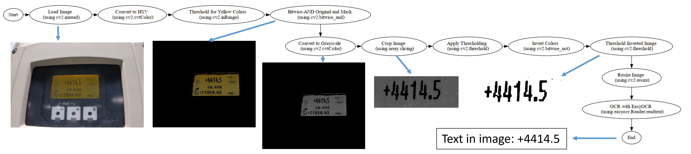

# Image OCR with EasyOCR, OpenCV, and PyTesseract

This Python application demonstrates the power of Optical Character Recognition (OCR) by extracting text from images using EasyOCR and PyTesseract, along with extensive image processing via OpenCV. Initially, it was built to process a set of images with distinct numbers. However, with the modifiable image processing pipeline in place, it can easily be adapted to various use cases and different types of images.




## Features

1. **Text Extraction from Images**: The core functionality lies in performing OCR on images using a blend of EasyOCR and PyTesseract to retrieve embedded text.

2. **Image Pre-processing**: 

   The application employs an elaborate image pre-processing pipeline to condition the images for effective OCR. These steps include:

   - **Color Space Conversion**: The application initially converts the image to HSV (Hue, Saturation, Value) color space to simplify color-based filtering.
   
   - **Color Filtering**: The script filters out specific colors (yellow, in the given case) in the HSV image to eliminate non-essential information. This is particularly useful when the text color contrasts with the background.
   
   - **Grayscale Conversion and Cropping**: Post color filtering, the image is converted to grayscale and then cropped to focus on the region of interest.
   
   - **Thresholding and Inversion**: To further refine the image for OCR, the script applies binary thresholding, inverts the color scheme for suitable contrast, and applies another round of thresholding to obtain black text on a white background.
   
   - **Image Resizing**: The processed image is then enlarged to improve resolution and enhance OCR accuracy.
   
   These steps are customizable, allowing the user to adjust the parameters to suit their specific use case.

3. **Recursive Search**: The script scans a directory and its subdirectories for images, since GoPros usually save up to 999 images in different folders.

4. **CSV Output**: The output (filename and the extracted text) is compiled into a CSV file, making it convenient for subsequent analysis and data manipulation.

5. **Verbose Mode for Debugging**: A verbose mode that displays each step of the image processing pipeline in separate windows. This interactive feature helps with troubleshooting and fine-tuning the image pre-processing steps.

## Requirements

- Python 3.7+
- OpenCV
- EasyOCR
- PyTesseract
- tqdm
- numpy

## Usage
The script is initiated by providing the path to the directory containing the images in the code. The script processes all images in that directory and its subdirectories and writes the output to a CSV file named `GOPRO_OCR.csv`.

```shell
python src/read_GOPRO_data.py
```

Verbose mode can be enabled by setting the verbose argument to 1.

License
This project is licensed under the MIT License - see the LICENSE file for details.
